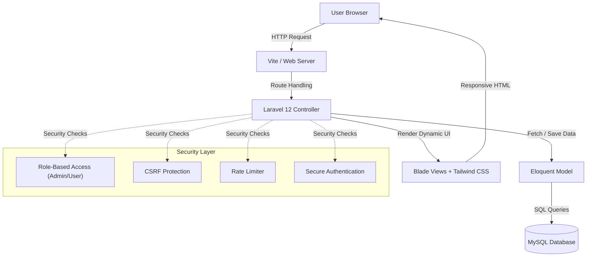
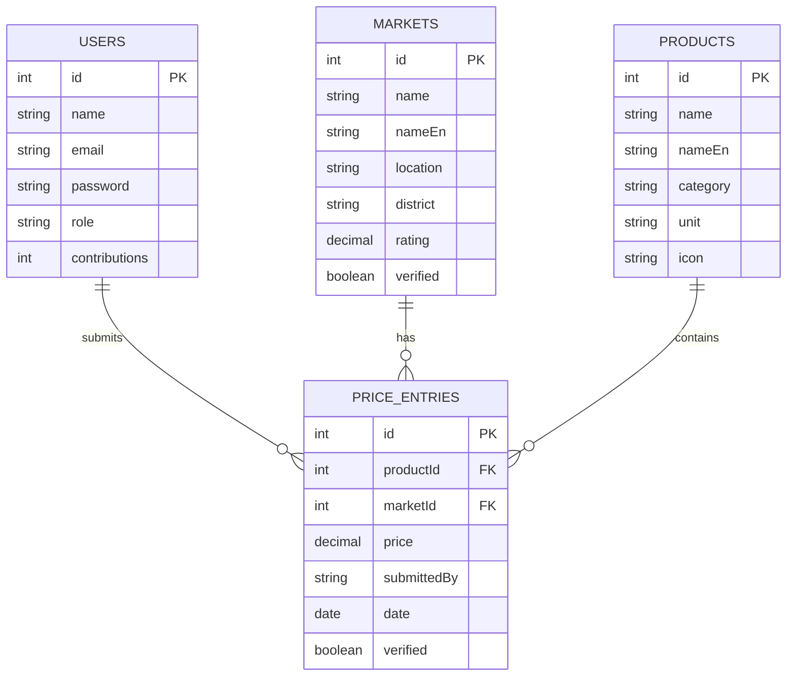
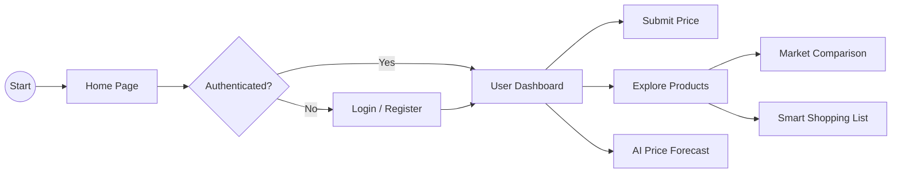
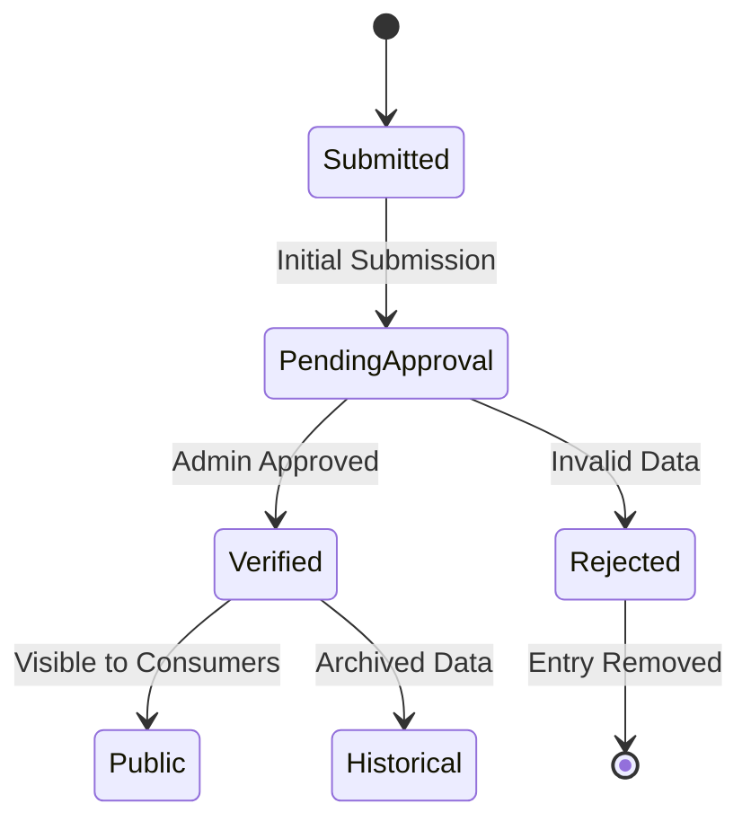

  <div align="center">            PriceWatch BD - Market Intelligence System

<div align="center">

[](https://visitorbadge.io/status?path=oynndri%2Fpricewatch-bd)
[](https://www.php.net/)
[](https://laravel.com/)
[](https://www.mysql.com/)
[](https://opensource.org/licenses/MIT)


</div>

---

## 🌟 Overview

**PriceWatch BD** is a state-of-the-art, feature-rich market intelligence platform designed for the **Bangladesh** community. It bridges the gap between consumers and authentic commodity prices, using a centralized repository for real-time tracking, AI-powered predictions, and market analysis.


### 🔴 The Problem
Consumers often struggle to find consistent, authentic market prices for daily essentials, leading to exploitation during inflation and a lack of transparency in the commodity market.

### 🟢 The Solution (PriceWatch BD)
A centralized, secure, and real-time portal that organizes market data across 64 districts, verifies submissions through admin moderation, and provides predictive insights through a premium-grade user experience.

---

## 🚀 Key Features

| | Feature | Description |
|---|---|---|
| 📦 | **Market Intelligence** | Real-time price tracking across 64 districts and 640+ markets with instant scannability. |
| 🔍 | **AI Price Prediction** | Advanced forecasting using machine learning to predict commodity prices for the next 7 days. |
| 🏆 | **Smart Shopping** | "Shopping List" feature that automatically finds the cheapest market for your selected items. |
| 🛡️ | **Admin Moderation** | Robust verification system for user-submitted prices to ensure data authenticity and reliability. |
| 📊 | **Interactive Trends** | Visual trend analysis using sparklines and integrated Chart.js for real-time market insights. |
| 📍 | **Market Matrix** | Map-based discovery of authentic markets with ratings, verification status, and location data. |

---

## 🖼️ System Preview

<div align="center">

| Market Insights | Mobile Experience |
| --- | --- |
|  |  |

</div>

---

## 🏗️ Architecture

PriceWatch BD follows a robust **Model-View-Controller (MVC)** architectural pattern using the **Laravel 12** framework for a reactive and scalable experience.



---

## 📊 Visual Documentation

### 🗄️ Database ER Diagram


### 🛣️ User Flow


### 🔁 Price Verification Process


---

## 🛡️ Security Hardening

- **CSRF Protection**: Native Laravel tokens for all state-changing interactions.
- **Role-Based Access Control**: Strict separation between Admin moderation and User submissions.
- **Rate Limiting**: Integrated anti-spam mechanisms for price submissions (Throttle middleware).
- **Secure Sessions**: HTTP-Only and SameSite cookie policies via Laravel Session layer.
- **XSS Prevention**: Automated Blade output encoding for all user-generated content.
- **SQLi Protection**: Full abstraction via Eloquent ORM and Query Builder.

---

## 🛠️ Installation Guide

### Prerequisites
- PHP 8.2+
- MySQL 8.0+
- Composer & NPM

### Setup Steps
1. **Clone the repository**:
   ```bash
   git clone https://github.com/oynndri/pricewatch-bd.git
   ```
2. **Install Dependencies**:
   ```bash
   composer install
   npm install
   ```
3. **Environment Setup**:
   - Copy `.env.example` to `.env`.
   - Configure your `DB_DATABASE`, `DB_USERNAME`, and `DB_PASSWORD`.
   ```bash
   php artisan key:generate
   ```
4. **Database Setup**:
   - Create the database and run migrations:
   ```bash
   php artisan migrate --seed
   ```
   - *Alternative*: Import `schema.sql` directly into your MySQL instance.
5. **Compile Assets & Launch**:
   ```bash
   npm run dev
   # Open another terminal
   php artisan serve
   ```

---

## 👩💻 Developed By

**Oynndrila Singh Purkayestha**  
*System Admin & Full Stack Developer*

[](https://www.linkedin.com/in/oynndrila-singh-purkayestha)
[](https://github.com/oynndri)

---
<div align="center">
  <sub>Built for the Bangladesh Market Transparency</sub>
</div>
